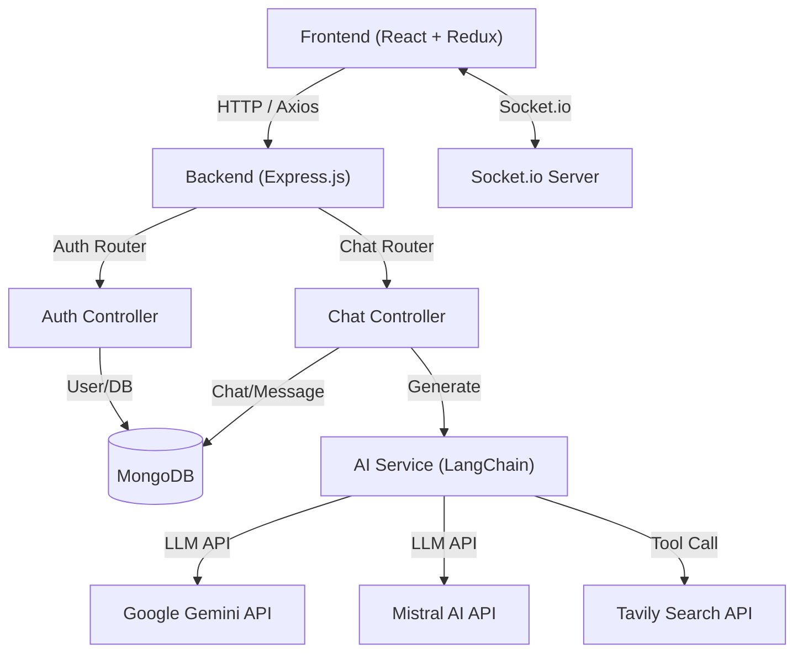

This repository contains a full-stack AI-powered chat application. It provides the infrastructure for users to register, log in, and interact with an AI model that supports internet-based search capabilities.

## 1. What is this repo?

The `Nachiket127/ai-chatapp` repository is a robust starting point for building a web-based AI chat platform. It uses a standard MERN-like stack (MongoDB, Express, React, Node.js) with specific integrations for AI orchestration and real-time communication.

The backend acts as the orchestrator. It manages user sessions via JWT (JSON Web Tokens) and cookies, handles chat persistence in a MongoDB database, and delegates complex logic to an AI service layer. This AI service layer leverages `langchain` to connect to Large Language Models (LLMs) such as Google's Gemini and Mistral AI, while also incorporating tool-use patterns (via `tavily`) to allow the model to search the internet for up-to-date information.

The frontend is built with React and Vite, using Redux Toolkit for state management, Tailwind CSS for styling, and `socket.io-client` for potential real-time capabilities. The project is designed with a clear separation of concerns, where the `Backend/` directory manages API routes, controllers, and services, and the `Frontend/` directory handles the user interface and state.

## 2. How all main components connect

The architecture follows a request-response flow common to Node.js applications, with an added layer of AI service delegation. When a user sends a message, it travels from the React frontend to an Express controller, which then invokes the LangChain-based AI service to generate a response.



## 3. Repository Structure

This structure shows the separation between the `Backend/` and `Frontend/` concerns.

```shell
Nachiket127/ai-chatapp/
├── Backend/
│   ├── public/
│   │   └── index.html
│   ├── server.js
│   ├── src/
│   │   ├── config/
│   │   │   └── database.js
│   │   ├── controllers/
│   │   │   ├── auth.controller.js
│   │   │   └── chat.controller.js
│   │   ├── middleware/
│   │   │   └── auth.middleware.js
│   │   ├── models/
│   │   │   ├── chat.model.js
│   │   │   ├── message.model.js
│   │   │   └── user.model.js
│   │   ├── routes/
│   │   │   ├── auth.routes.js
│   │   │   └── chat.routes.js
│   │   ├── services/
│   │   │   ├── ai.services.js
│   │   │   ├── internet.services.js
│   │   │   └── mail.services.js
│   │   └── sockets/
│   │       └── server.socket.js
│   └── package.json
└── Frontend/
    ├── src/
    │   ├── app/
    │   │   ├── App.jsx
    │   │   ├── app.routes.jsx
    │   │   └── app.store.js
    │   ├── features/
    │   │   ├── auth/
    │   │   └── chat/
    │   └── main.jsx
    ├── package.json
    └── vite.config.js
```

## 4. Other important information

### Technology Stack
*   **Backend:** Node.js, Express, MongoDB (via Mongoose), Socket.io (for real-time communication), LangChain (for AI orchestration), `bcrypt` (for password hashing), `jsonwebtoken` (for authentication), `nodemailer` (for verification emails), `zod` (for schema validation).
*   **Frontend:** React, Vite, Redux Toolkit (state management), Axios (HTTP client), Tailwind CSS (styling), Lucide React (icons), React Router.

### Key Logic & Features

1.  **AI Orchestration (`Backend/src/services/ai.services.js`)**: 
    The application does not just hit an LLM endpoint directly. It uses `createAgent` from LangChain to define an agent capable of using tools. Specifically, it exposes `searchInternet` as a tool. If the user asks a question requiring fresh data, the agent can invoke this tool before formulating its final response.
2.  **Authentication Flow (`Backend/src/controllers/auth.controller.js`)**:
    The system implements a standard registration-to-verification workflow. Upon registration, the backend creates a user in the database, generates a JWT token for email verification, and sends a verification link via `mail.services.js`. The user cannot log in until `verified` is set to `true` in the user model.
3.  **Real-time Infrastructure (`Backend/src/sockets/server.socket.js`)**:
    The application initializes a Socket.io server alongside the Express server. While the primary chat interaction logic is handled via HTTP routes in `Backend/src/controllers/chat.controller.js`, the infrastructure is in place for real-time bidirectional events.
4.  **Application Entry Points**:
    *   The backend starts at `Backend/server.js`, which configures `dns` settings, creates the HTTP server, initializes Socket.io, and connects to the database via `Backend/src/config/database.js`.
    *   The frontend entry point is `Frontend/src/main.jsx`, which wraps the application in the Redux `Provider` and renders `Frontend/src/app/App.jsx`.

